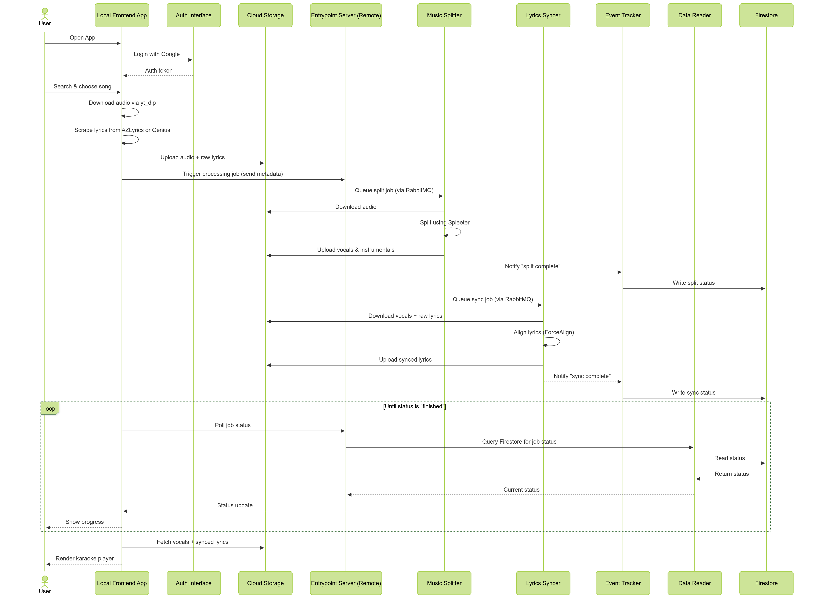

# VoxOff: AI-Powered Karaoke Web App

## What is VoxOff? 

VoxOff is an end-to-end karaoke platform that lets users sing along to their favorite tracks with real-time, word-by-word lyric highlighting. Users can search for any song, and VoxOff will:

- Automatically download the audio,

- Strip out vocals to generate a clean instrumental,

- Scrape lyrics from trusted sources,

- Sync lyrics to the vocals using forced alignment,

- And serve everything back in a smooth web interface with a built-in karaoke player.

Behind the scenes, VoxOff uses a hybrid architecture: audio and lyrics are fetched locally, but heavy processing like vocal separation and alignment runs on the cloud. The result is a lightweight, scalable, and responsive karaoke experience.

## What are the main features? 
- Song Search – Search for songs by title or artist using Genius integration.

- Audio Downloader – Fetch high-quality audio directly from YouTube.

- Vocal Isolation – Separate vocals and instrumentals using Spleeter.

- Lyrics Scraping – Extract lyrics from Genius or AZLyrics.

- Forced Alignment – Sync lyrics word-by-word to the audio using ForceAlign.

- Interactive Karaoke Player – Displays synced lyrics with line-by-line highlighting in a built-in audio player.

- Cloud-Based Processing – Offload intensive tasks to Kubernetes-hosted services on GKE.

- Google OAuth Login – Simple and secure authentication.

- User History Tracking – View previously processed or played songs.

- Similar Song Recommendations – Discover related tracks using Last.fm metadata.

## The underlying tech
- Frontend
  - Flask for the web interface and routing
  - JavaScript and Bootstrap for dynamic components and styling
- Backend Services
  - Firestore (NoSQL) for storing user data and job status
  - RabbitMQ for managing task queues between services
- Audio & Lyrics Processing
  - yt_dlp to download audio from YouTube 
  - Spleeter for vocal and instrumental separation 
  - ForceAlign for aligning lyrics with vocals 
  - BeautifulSoup and Requests for scraping lyrics from Genius and AZLyrics
- Infrastructure
  - Docker for containerizing services
  - Kubernetes (GKE) for cloud deployment and orchestration
  - Terraform for infrastructure-as-code deployment
  - Redis for managing background task metadata
  - Google Cloud Storage for storing media files
- Authentication
  - Google OAuth 2.0 for user login and session management

## How it all works (architecture overview)
VoxOff follows a hybrid architecture: a lightweight local frontend handles user interaction, while cloud-based services perform compute-heavy audio and lyrics processing.

Here’s how the system works end-to-end:
1. User logs in via Google OAuth. This flow is handled by a dedicated Auth Service, which:
   - Performs OAuth 2.0 login with Google 
   - Retrieves user profile information 
   - Issues a secure session token for the frontend to use in authenticated requests
2. After login, the user selects a song using the local Flask frontend, which searches Genius for results.
3. The local frontend:
   - Downloads audio from YouTube using yt_dlp 
   - Scrapes lyrics from Genius or AZLyrics 
   - Uploads both to Google Cloud Storage
4. It then sends a job initiation request to the frontend service (the orchestration backend, despite its misleading name).
5. The frontend service publishes a message to RabbitMQ, triggering the Music Splitter service.
6. The Music Splitter:
   - Downloads the audio from GCS 
   - Runs Spleeter to isolate vocals and instrumental. 
   - Uploads the processed audio files back to GCS 
   - Sends a status update to the Event Tracker, which writes job state updates to Firestore 
   - Then enqueues a follow-up message for the Lyrics Syncer service
7. The Lyrics Syncer:
   - Downloads the isolated vocals and lyrics from GCS 
   - Runs ForceAlign to generate a time-synced lyrics.json 
   - Uploads the aligned lyrics file to GCS 
   - Reports completion to the Event Tracker, which again updates Firestore
8. The Data Reader service acts as a lightweight REST API layer over Firestore, exposing job status, history and user details to the local frontend. 
9. The local frontend periodically polls the frontend service, which in turn calls the Data Reader to fetch the current job status. 
10. Once the job is marked complete, the karaoke player loads the instrumental track and synced lyrics, and displays a real-time karaoke interface with line-by-line lyric highlighting, synchronized with audio playback.

## Visual Architecture Overview

To complement the system explanation above, the following diagrams illustrate the high-level architecture and runtime sequence of VoxOff.

### System Architecture Diagram


### Sequence Diagram


## Installation
>   Note: VoxOff is a course project built on private infrastructure. It depends on restricted access to our Google Cloud Platform (GCP) environment, including Artifact Registry, Firestore, and Cloud Storage buckets. As such, this project cannot be run outside of our team’s authenticated setup.

### System Overview
The application is split across two environments:
- A local frontend (Flask) for user interaction and audio/lyrics ingestion. 
- A set of cloud-hosted services deployed on GKE for compute-intensive tasks like vocal separation and forced alignment.

### Prerequisites (for team members)
To run or deploy the system, ensure you have:
- Access to our team's GCP project and service account credentials 
- Python 3.9
- Docker 
- Terraform (v1.5+)
- Redis and RabbitMQ (Dockerized)
- Google Cloud SDK (gcloud)
- GCP service account keys

### Local Setup (Frontend + Downloader)
```
# Clone the repository
git clone https://github.com/nehakolambe/karaoke-app.git
cd voxoff

# Set up a shared Python virtual environment
python -m venv venv
source venv/bin/activate

# Install dependencies for the local frontend (Flask UI)
cd frontend
pip install -r requirements.txt

# Install dependencies for the music downloader
cd ../music_downloader
pip install -r requirements.txt

# Install dependencies for the auth service
cd ../auth
pip install -r requirements.txt
```

### Running the local frontend and auth
Terminal 1: Run the Auth Service (FastAPI on port 8000)
```bash
cd auth
uvicorn main:app --host 0.0.0.0 --port 8000
```
Terminal 2: Run the Frontend (Flask on port 5000)
```bash
python ./frontend/app.py
```

## Usage

Using VoxOff is simple and intuitive. Here's how a typical user session looks:

1. **Log In**  
   Visit the homepage and sign in using your Google account. This helps personalize your experience and keeps track of songs you've processed.

2. **Search for a Song**  
   Use the search bar to look for your favorite tracks. As you type, live suggestions appear based on song titles and artists.

3. **Select and Process**  
   Pick a song from the suggestions. VoxOff will automatically fetch the audio and lyrics, then begin processing it to create a karaoke-ready version.

4. **Wait for Processing**  
   While your song is being prepared, you'll see a loading screen. This usually takes a few seconds.

5. **Sing Along**  
   Once ready, the karaoke player opens with the instrumental version of the song and lyrics highlighted line-by-line in sync with the music.

6. **View Your History**  
   You can revisit any song you've processed in the past from your profile page, and discover similar songs based on your preferences.

## Project Status

This project was developed as part of the Big Data Architecture course at University of Colorado, Boulder. All core functionality has been implemented and tested on private infrastructure. Key features like audio separation, lyrics alignment, synced playback, and user history are complete.

Future improvements could include:
- Word-level lyrics highlighting
- Public deployment with limited access
- Support for real-time duet/collaborative karaoke

---

Made with 💡, 🎵, and ☁️ by Team VoxOff  
University of Colorado Boulder · Spring 2025 · CSCI 5834: Big Data Architecture